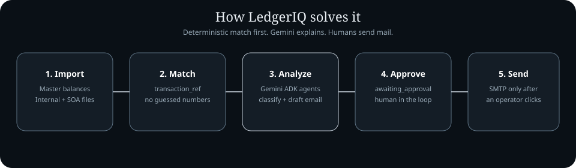
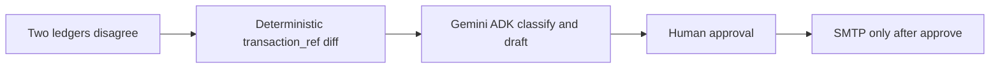
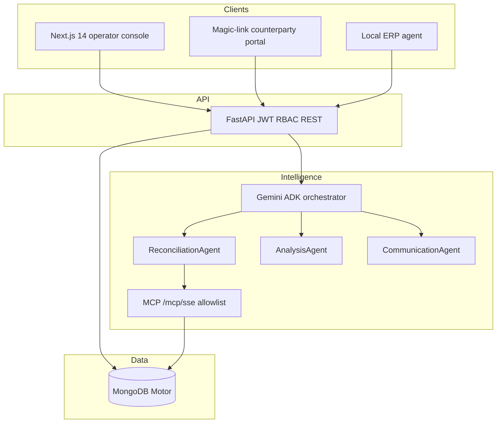
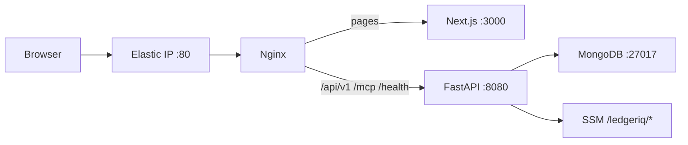

<div align="center">


**Agentic B2B financial reconciliation — AI assists. Humans decide.**

# Live demo

### [http://54.66.101.162](http://54.66.101.162)

| | |
| :--- | :--- |
| **Open the app** | [http://54.66.101.162](http://54.66.101.162) |
| **Sign in** | [http://54.66.101.162/login](http://54.66.101.162/login) |
| **Username** | `admin` |
| **Password** | `LedgerIQ-Demo` |

Use **Fill demo login** on the sign-in page, then walk the dashboard, counterparties, reconciliation, and discrepancies.

[](LICENSE)
[](frontend/)
[](backend/)
[](https://www.mongodb.com/)
[](https://ai.google.dev/)


</div>

---

## The problem

B2B finance teams keep **two books for the same relationship**: an internal ERP ledger and a counterparty statement of account. Those books diverge every month.

- **Amount mismatch** — same `transaction_ref`, different money
- **Missing record** — you billed it; they never booked it (or the reverse)
- **Date / FX drift** — same invoice, different posting date or currency rounding
- **Duplicate payment** — one side paid twice

The usual fix is Excel: VLOOKUP, screenshots, and an email written from scratch. That leaks revenue, has no audit trail, and cannot scale across hundreds of counterparties.


---

## How LedgerIQ solves it

LedgerIQ does **not** let a language model invent the match. Numbers are decided by a deterministic Python diff. Gemini only explains the gap and drafts the email. A human still has to approve before SMTP runs.

1. **Import both sides** — master balances, internal statements, counterparty SOA (Excel/CSV), or a magic-link portal upload.
2. **Match on `transaction_ref`** — `ReconciliationEngine` in `backend/agent/reconciliation_engine.py` diffs the pair. Same ref + same amount is a match. Anything else becomes a discrepancy.
3. **Analyze with Gemini ADK** — three sub-agents (Reconciliation, Analysis, Communication) classify the gap and draft a resolution email.
4. **Hold at `awaiting_approval`** — nothing leaves the building until an authorized operator clicks approve.
5. **Send** — SMTP only after that click; status moves to `email_sent`.





---

## System design

Operator UI and the counterparty portal talk **only** to FastAPI. FastAPI owns JWT, RBAC, and orchestration. Gemini ADK agents do not open a raw Mongo connection — they call an allowlisted MCP server mounted at `/mcp/sse`. An optional local ERP agent pushes Excel/CSV/SAP-style exports into the same API.




**Agent pipeline (what each model is for):**

- **ReconciliationAgent** — fetch the ledger pair (via MCP `find`) and list refs that do not match
- **AnalysisAgent** — root cause (timing, FX, duplicate, missing) in 2–3 sentences for accountants
- **CommunicationAgent** — formal B2B email with both amounts and a polite ask — never auto-sent

---

## Important features

- **Deterministic matching** — `transaction_ref` + amount/date compare in Python. Gemini does not pick the winner on core numbers.
- **AI discrepancy analysis** — ADK drafts classification and email copy for each gap.
- **Human-in-the-loop** — discrepancy status is `detected` → `awaiting_approval` → `email_sent` / `resolved` / `disputed`.
- **Counterparty portal** — magic link so the other party uploads their statement without an account.
- **RBAC** — System Administrator, Manager, IT Specialist, Staff. JWT (HS256) on `/api/v1`.
- **ERP package** — downloadable local agent for Excel, CSV, and SAP-style exports (`local_erp_agent/`).
- **In-app Gemini chat** — page-aware assistant on the console (`/api/v1/gemini/chat`).
- **Agent-run timeline** — each reconciliation writes an `agent_runs` document so operators can watch or cancel a run.

---

## Tech stack — what each piece is for

This is not a laundry list. Each technology exists to close a specific failure mode of spreadsheet reconciliation.

| Technology | Problem it solves |
| :--- | :--- |
| **Next.js 14 + TypeScript + Tailwind + React Query** | Operators need a fast console (dashboard, filters, approvals) and a separate unauthenticated portal. App Router keeps those surfaces in one app. |
| **FastAPI + Pydantic v2 + Python 3.12** | Money, refs, and statuses must be typed. A loosely-typed Node handler is how $8,150 silently becomes a string. |
| **MongoDB + Motor** | Ledgers, discrepancies, sessions, and agent runs are document-shaped and write-heavy during a run. Motor keeps FastAPI async. Unique index on `(transaction_ref, company_id)` stops duplicate imports. |
| **Google Gemini + ADK** | Accountants need *why* and a draft email, not another pivot table. Three specialized agents stay narrower (and cheaper) than one giant prompt. |
| **MCP over SSE (`/mcp/sse`)** | Language models must not get a live Mongo URI. MCP exposes only allowlisted tools (`find`, and similar). |
| **JWT HS256 + RBAC** | Approving an email is a privileged act. Cookies are set `Secure` only when `COOKIE_SECURE=true` so the HTTP demo still works. |
| **passlib bcrypt** | Admin seed and user passwords are hashed. Production (`DEBUG=false`) does not rewrite the hash on every login. |
| **Docker Compose on one EC2** | This project is a single-region demo, not a multi-account mesh. Compose is enough: nginx, frontend, backend, mongo. |
| **AWS SSM** | `SECRET_KEY`, admin password, and Gemini key stay out of git and out of the AMI. |

---

## Deployment

Live project Region is **ap-southeast-2**. All regional resources stay there.




- **Host:** Amazon Linux EC2, Docker Compose (`docker-compose.prod.yml`)
- **Edge:** nginx listens on 80 and splits traffic (`deploy/nginx.conf`)
- **Secrets:** SSM `/ledgeriq/secret-key`, `/ledgeriq/admin-password`, `/ledgeriq/gemini-api-key`
- **Bootstrap:** `deploy/user-data.sh` pulls the source tarball, writes `.env` from SSM, then `docker compose up -d --build`
- **UI refresh:** `deploy/deploy-ui.sh` overlays frontend sources and rebuilds the frontend container

No `.env` files are committed.

---

## Local quick start

```bash
git clone https://github.com/keshav-077/Ledgeriq----Agentic-B2B-financial-reconciliation.git
cd Ledgeriq----Agentic-B2B-financial-reconciliation
cp .env.example .env
cp frontend/.env.local.example frontend/.env.local
```

Set `SECRET_KEY`, `GEMINI_API_KEY`, `ADMIN_USERNAME`, and `ADMIN_PASSWORD` in `.env`. Then:

```bash
docker compose up mongo -d
cd backend && python -m venv .venv && pip install -r requirements.txt
uvicorn main:app --reload --port 8000
```

```bash
cd frontend && npm install && npm run dev
```

Open [http://localhost:3000](http://localhost:3000).

---

## Project structure

```text
├── frontend/            Next.js 14 — landing, login, dashboard, portal
├── backend/             FastAPI, ADK agents, MCP server, services
├── local_erp_agent/     Downloadable ERP sync agent
├── deploy/              nginx, EC2 user-data, UI refresh script
├── docs/assets/         Logo, architecture and design SVGs, demo GIF
├── docker-compose.yml   Local backend + MongoDB
└── docker-compose.prod.yml   nginx + frontend + backend + mongo
```

---

<div align="center">


**LedgerIQ** — *Reconciliation reinvented.*

Live: [http://54.66.101.162](http://54.66.101.162) · `admin` / `LedgerIQ-Demo`

Built by [keshav-077](https://github.com/keshav-077)

</div>
