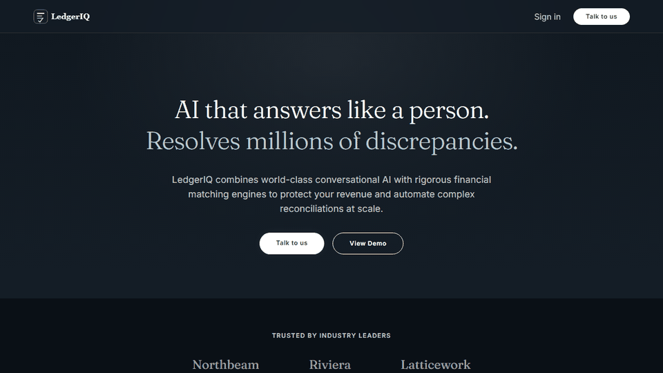
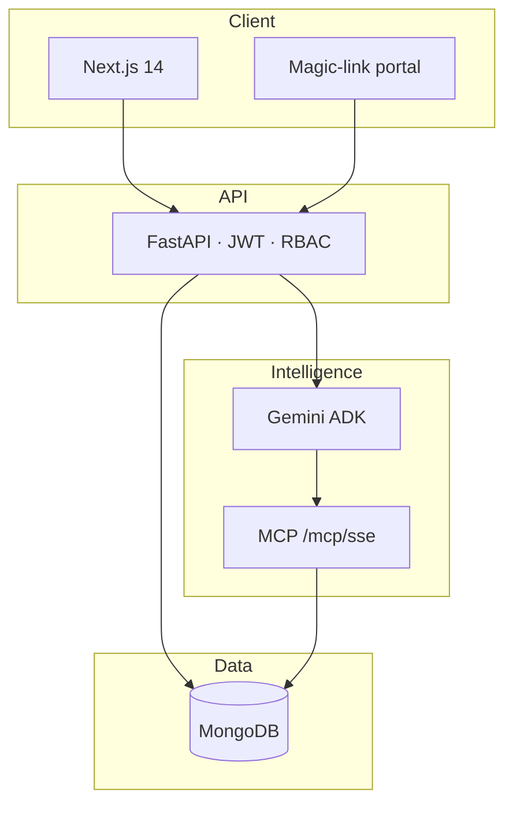

<div align="center">


### Agentic B2B financial reconciliation — AI assists. Humans decide.

<br/>

# Live demo

### [http://54.66.101.162](http://54.66.101.162)

| | |
| :--- | :--- |
| **Open the app** | [http://54.66.101.162](http://54.66.101.162) |
| **Sign in** | [http://54.66.101.162/login](http://54.66.101.162/login) |
| **Username** | `admin` |
| **Password** | `LedgerIQ-Demo` |

Recruiters and friends: use **Fill demo login** on the sign-in page, then walk the dashboard, counterparties, reconciliation, and discrepancies.

[](LICENSE)
[](frontend/)
[](backend/)
[](https://www.mongodb.com/)
[](https://ai.google.dev/)

<br/>



</div>

---

## What it does

LedgerIQ ingests internal and counterparty ledger data, matches by `transaction_ref`, and uses Gemini multi-agent pipelines to classify discrepancies and draft resolution emails — with human-in-the-loop approval before anything is sent.

| Capability | Description |
| :--- | :--- |
| **Deterministic matching** | Diffs ledgers by transaction reference — no black-box guessing on core numbers |
| **AI discrepancy analysis** | Google Gemini + ADK agents classify mismatches and draft resolution emails |
| **Human-in-the-loop** | Every outbound email stays `awaiting_approval` until an authorized user approves |
| **Counterparty portal** | Magic-link portal for external parties to submit statements |
| **RBAC & JWT** | Role-based permissions across dashboard, settings, and approvals |
| **ERP agent** | Downloadable local agent for Excel, CSV, and SAP-style exports |
| **MCP-secured tools** | Agents reach MongoDB only through an allowlisted `/mcp/sse` server |

---

## Architecture




---

## Tech stack

| Layer | Technologies |
| :--- | :--- |
| **Frontend** | Next.js 14, TypeScript, Tailwind CSS, React Query |
| **Backend** | FastAPI, Python 3.12, Pydantic v2, Motor |
| **Database** | MongoDB |
| **AI** | Google Gemini, Google ADK, MCP over SSE |
| **Auth** | JWT (HS256), RBAC |
| **Deploy** | Docker Compose on AWS (ap-southeast-2) |

---

## Local quick start

```bash
git clone https://github.com/keshav-077/Ledgeriq----Agentic-B2B-financial-reconciliation.git
cd Ledgeriq----Agentic-B2B-financial-reconciliation
cp .env.example .env
cp frontend/.env.local.example frontend/.env.local
```

Set `SECRET_KEY`, `GEMINI_API_KEY`, `ADMIN_USERNAME`, and `ADMIN_PASSWORD` in `.env`. Then:

```bash
docker compose up mongo -d
cd backend && python -m venv .venv && pip install -r requirements.txt
uvicorn main:app --reload --port 8000
```

```bash
cd frontend && npm install && npm run dev
```

Open [http://localhost:3000](http://localhost:3000).

---

## Project structure

```text
├── frontend/          Next.js 14 — dashboard, portal, landing
├── backend/           FastAPI, ADK agents, MCP server
├── local_erp_agent/   Downloadable ERP sync agent
├── docs/assets/       Logo, architecture SVGs, demo GIF
└── docker-compose.yml Local backend + MongoDB
```

---

<div align="center">

**LedgerIQ** — *Reconciliation reinvented.*

Live: [http://54.66.101.162](http://54.66.101.162) · `admin` / `LedgerIQ-Demo`

Built by [keshav-077](https://github.com/keshav-077)

</div>
