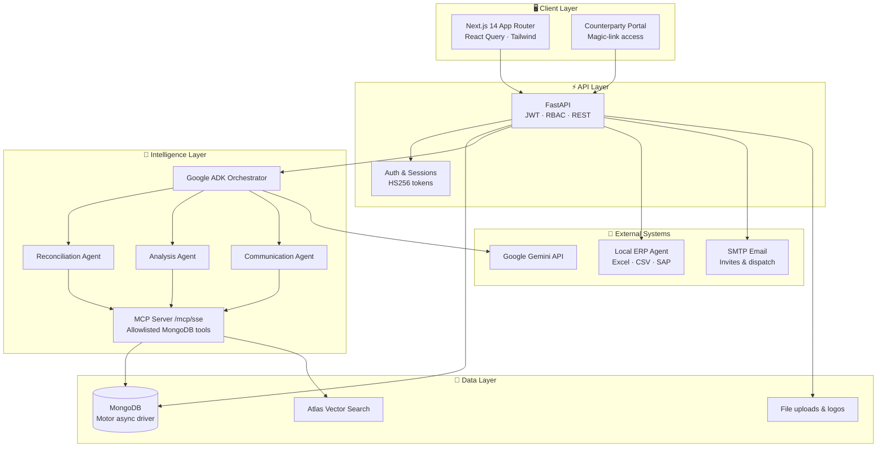
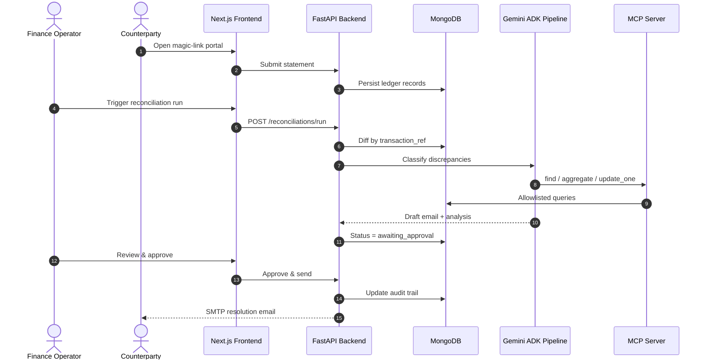

<div align="center">

# LedgerIQ

### Agentic B2B Financial Reconciliation — built for precision, governed by humans.

[](LICENSE)
[](frontend/)
[](backend/)
[](https://www.mongodb.com/)
[](https://ai.google.dev/)
[](frontend/)
[](backend/)

**LedgerIQ ingests internal & counterparty ledger data, matches by transaction reference, and uses Gemini multi-agent pipelines to classify discrepancies and draft resolution emails — with human-in-the-loop approval before anything is sent.**

[Features](#-what-it-does) · [Architecture](#-architecture) · [Agent Pipeline](#-ai-agent-pipeline) · [Quick Start](#-quick-start) · [Skills Demonstrated](#-skills-demonstrated)

<br/>


</div>

---

## ✨ What it does

LedgerIQ is a **full-stack fintech operations platform** that automates the messy middle of B2B reconciliation — without removing human accountability.

| Capability | Description |
| :--- | :--- |
| **Deterministic matching** | Diffs ledgers by `transaction_ref` — no black-box guessing on core numbers |
| **AI discrepancy analysis** | Google Gemini + ADK agents classify mismatches and draft resolution emails |
| **Human-in-the-loop (HITL)** | Every outbound email stays `awaiting_approval` until an authorized user approves |
| **Counterparty portal** | Magic-link portal for external parties to submit statements securely |
| **RBAC & JWT auth** | Role-based permissions across dashboard, settings, and approval flows |
| **ERP integration** | Downloadable local agent syncs Excel, CSV, SAP, Logo, and Mikro exports |
| **MCP-secured data access** | Custom MCP server gives agents allowlisted MongoDB tool access via `/mcp/sse` |
| **Production-grade UI** | Dark glass-morphism design system — Fraunces + Inter, built for finance teams |

<br/>


---

## 🏗 Architecture



### Request lifecycle



---

## 🤖 AI agent pipeline

LedgerIQ uses **Google Agent Development Kit (ADK)** with three specialized sub-agents orchestrated by a root agent:

| Agent | Responsibility |
| :--- | :--- |
| **Reconciliation Agent** | Runs matching logic, surfaces unmatched records |
| **Analysis Agent** | Classifies discrepancy types, root-cause reasoning |
| **Communication Agent** | Drafts professional resolution emails for HITL review |

Agents never get raw database credentials — they route through an **MCP server** with an explicit collection allowlist:

| MCP Tool | Purpose |
| :--- | :--- |
| `find` | Query companies, ledgers, discrepancies |
| `aggregate` | Analytics pipelines & trend breakdowns |
| `insert_one` | Persist agent run metadata |
| `update_one` | Update discrepancy analysis & drafts |
| `vector_search` | Semantic search via Atlas Vector Search |

---

## 🛠 Tech stack

| Layer | Technologies |
| :--- | :--- |
| **Frontend** | Next.js 14, TypeScript, Tailwind CSS, React Query, Lucide icons |
| **Backend** | FastAPI, Python 3.12, Pydantic v2, Motor (async MongoDB) |
| **Database** | MongoDB + optional Atlas Vector Search |
| **AI** | Google Gemini, Google ADK multi-agent orchestration |
| **Auth** | JWT (HS256), RBAC, HTTP-only session cookies |
| **Integrations** | SMTP, custom MCP over SSE, downloadable ERP sync agent |
| **DevOps** | Docker Compose, env-driven configuration |

---

## 🚀 Quick start

### Prerequisites

- Python 3.12+
- Node.js 18+
- MongoDB (local, Docker, or [Atlas](https://www.mongodb.com/atlas))
- [Gemini API key](https://ai.google.dev/)

### 1. Clone & configure

```bash
git clone https://github.com/keshav-077/Ledgeriq----Agentic-B2B-financial-reconciliation.git
cd Ledgeriq----Agentic-B2B-financial-reconciliation

cp .env.example .env
cp frontend/.env.local.example frontend/.env.local
```

Set in `.env`:

```env
SECRET_KEY=your-strong-random-key
DEBUG=true
GEMINI_API_KEY=your_gemini_api_key
ADMIN_USERNAME=admin
ADMIN_PASSWORD=your_admin_password
MONGODB_URI=mongodb://localhost:27017
```

### 2. Start MongoDB

```bash
docker compose up mongo -d
```

### 3. Backend

```bash
cd backend
python -m venv .venv
.\.venv\Scripts\Activate.ps1   # Windows
pip install -r requirements.txt
uvicorn main:app --reload --port 8000
```

Health check: [`http://localhost:8000/health`](http://localhost:8000/health)

### 4. Frontend

```bash
cd frontend
npm install
npm run dev
```

Open **[http://localhost:3000](http://localhost:3000)** and sign in with your admin credentials.

---

## 📁 Project structure

```text
├── frontend/          Next.js 14 app — dashboard, portal, integrations UI
├── backend/
│   ├── api/routes/    REST endpoints (auth, reconciliations, discrepancies…)
│   ├── agent/         ADK agents, MCP server, reconciliation engine
│   ├── services/      Business logic layer
│   └── core/          Config, database, auth middleware
├── local_erp_agent/   Downloadable ERP sync agent (ZIP from dashboard)
├── docs/              UI/UX specs and architecture assets
└── docker-compose.yml Backend + MongoDB services
```

---

## 💼 Skills demonstrated

> *Built as a portfolio-grade full-stack AI product — not a tutorial CRUD app.*

| Domain | What this project proves |
| :--- | :--- |
| **Full-stack engineering** | End-to-end Next.js + FastAPI product with typed APIs and shared auth |
| **AI systems design** | Multi-agent orchestration, tool use, MCP protocol, HITL guardrails |
| **Fintech domain modeling** | Reconciliation workflows, discrepancy lifecycle, audit-friendly states |
| **Security mindset** | JWT/RBAC, env-driven secrets, MCP allowlists, production SECRET_KEY validation |
| **UX for enterprise** | Dark design system, operator dashboards, counterparty self-service portal |
| **DevOps readiness** | Docker Compose, configurable CORS/URLs, health endpoints |

---

## 🔐 Security notes

- Never commit `.env` — use `.env.example` as a template
- `DEBUG=false` rejects insecure default `SECRET_KEY` values
- MCP collection access is explicitly allowlisted
- ERP agent config ships with placeholders only — generate keys from the Integrations dashboard

---

## 📄 License

Licensed under the [Apache License 2.0](LICENSE).

---

<div align="center">

**LedgerIQ** — *Reconciliation reinvented. AI assists. Humans decide.*

Built by [keshav-077](https://github.com/keshav-077)

⭐ Star this repo if you find it useful

</div>
