# LedgerIQ Frontend — UI/UX Reference Document (historical)

> **Product:** LedgerIQ (formerly documented as Lumina). Visual system is now the dark LedgerIQ design.

> **Product:** Lumina — AI Reconciliation Agent  
> **Stack:** Next.js 14 · React 18 · Tailwind CSS · TanStack Query · Recharts · D3  
> **Last updated:** September 2026

This document describes the complete Lumina frontend: design system, architecture, every page layout, shared components, user flows, and UI diagrams.

---

## Table of Contents

1. [Technology Stack](#1-technology-stack)
2. [Design System](#2-design-system)
3. [Application Architecture](#3-application-architecture)
4. [AppShell Layout](#4-appshell-layout)
5. [Global Components](#5-global-components)
6. [Page Reference (with UI Diagrams)](#6-page-reference-with-ui-diagrams)
7. [User Flows](#7-user-flows)
8. [Responsive Behavior](#8-responsive-behavior)
9. [Keyboard Shortcuts](#9-keyboard-shortcuts)
10. [Permissions & Roles](#10-permissions--roles)
11. [File Structure](#11-file-structure)

---

## 1. Technology Stack

| Layer | Technology | Purpose |
|-------|------------|---------|
| Framework | Next.js 14 App Router | Routing, SSR layout, middleware |
| UI | React 18 + Tailwind CSS 3 | Components & styling |
| Icons | Lucide React | Consistent iconography |
| Data | TanStack React Query | Caching, polling, mutations |
| Charts | Recharts | Bar, pie, activity charts |
| Maps | D3 + TopoJSON | Counterparty network map (lazy) |
| AI Chat | react-markdown | Gemini panel responses |
| Font | Inter (Google Fonts) | Typography |
| HTTP | Axios (`@/lib/api`) | Backend API calls |

---

## 2. Design System

### 2.1 Color Palette

```
┌─────────────────────────────────────────────────────────────────┐
│  BRAND COLORS                                                   │
├─────────────────┬───────────┬───────────────────────────────────┤
│  Primary Green  │  #29BE98  │  CTAs, success, active nav       │
│  Secondary Blue │  #2597F8  │  Info, docs, ERP actions          │
│  Background     │  #F8FAFC  │  Page shell                       │
│  Surface        │  #FFFFFF  │  Cards, modals                    │
│  Border         │  #E2E8F0  │  Card/table borders               │
├─────────────────┼───────────┼───────────────────────────────────┤
│  Text Primary   │  slate-900│  Headings                         │
│  Text Secondary │  slate-500│  Descriptions, labels             │
│  Text Muted     │  #94A3B8  │  Hints, metadata                  │
├─────────────────┼───────────┼───────────────────────────────────┤
│  Warning        │  #f59e0b  │  Pending, amount mismatch         │
│  Error          │  #ef4444  │  Delete, disputed, errors         │
│  Purple         │  #8b5cf6  │  Agent run, duplicate type        │
└─────────────────┴───────────┴───────────────────────────────────┘
```

### 2.2 Typography Scale

| Element | Classes | Example |
|---------|---------|---------|
| Page title | `text-xl–2xl font-bold text-slate-900` | Dashboard |
| Page subtitle | `text-sm text-slate-500` | Real-time B2B reconciliation overview |
| Section header | `text-sm font-semibold` | Discrepancy Feed |
| Field label | `text-[11px] uppercase tracking-widest` | USERNAME |
| Body | `text-sm` | Form inputs, table cells |
| Mono data | `font-mono text-sm` | Ledger refs, tax IDs |

### 2.3 Spacing & Shape

| Token | Value | Usage |
|-------|-------|-------|
| Content max-width | `max-w-6xl` | AppShell main area |
| Settings max-width | `max-w-5xl` | Settings page |
| Card radius | `rounded-2xl` | All cards, modals |
| Button radius | `rounded-xl` | Primary/secondary buttons |
| Pill radius | `rounded-full` | Marketing CTAs, bulk bars |
| Card padding | `p-4` – `p-6` | Stat cards, modals |
| Page padding | `px-4 sm:px-6 lg:px-8 py-6 sm:py-8` | Main content |

### 2.4 Recurring UI Patterns

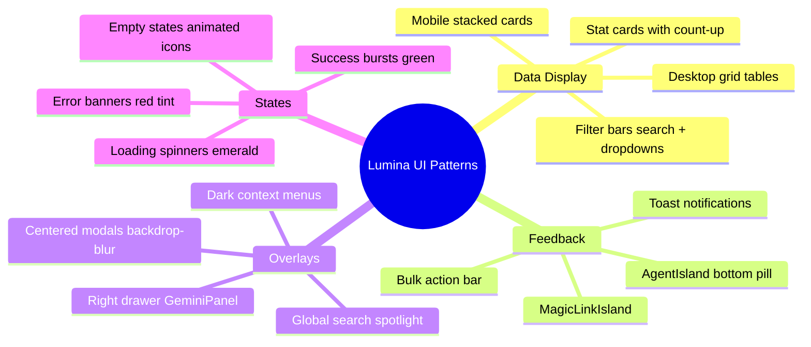

---

## 3. Application Architecture

### 3.1 Route Map

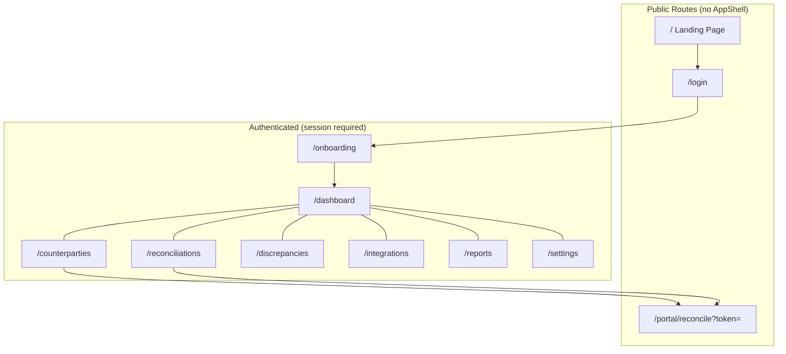

### 3.2 Auth & Middleware Flow

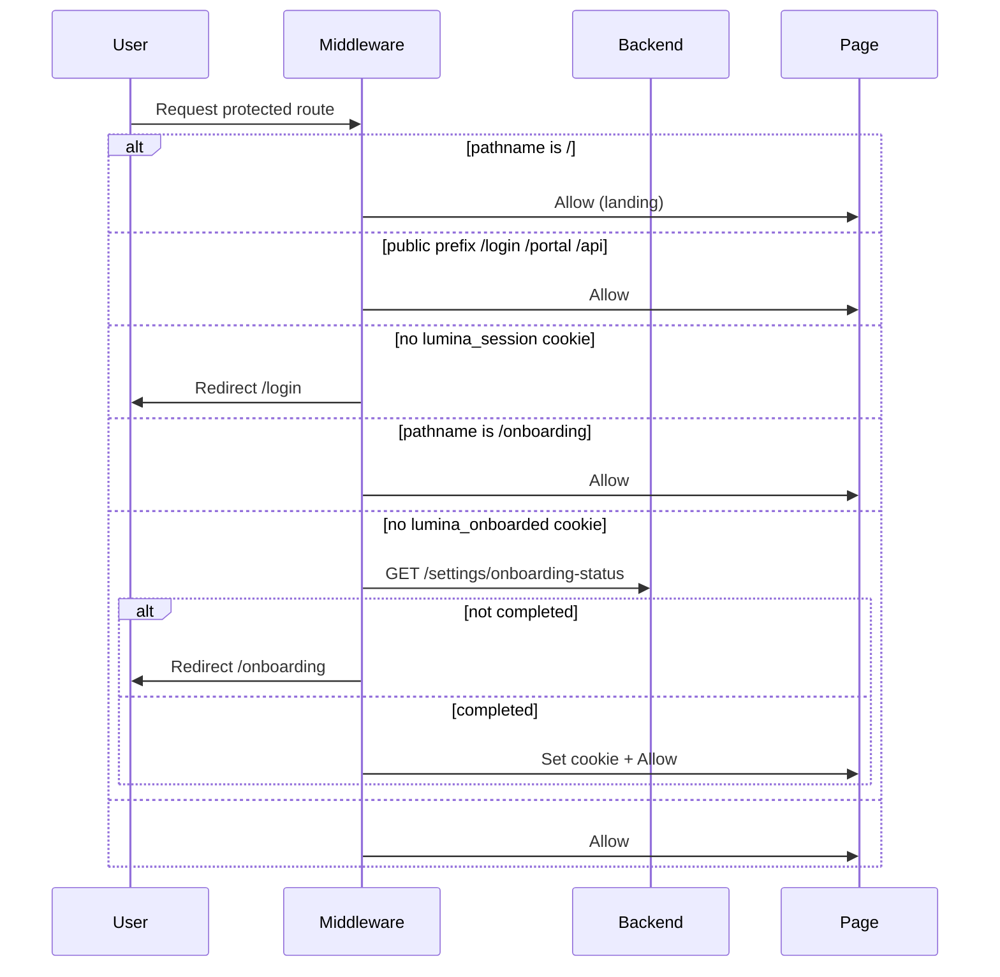

> Demo credentials are not shown in the product UI. Seed them via `ADMIN_PASSWORD` / `LUMINA_PASSWORD` in `.env`.

### 3.3 Root Layout Component Tree

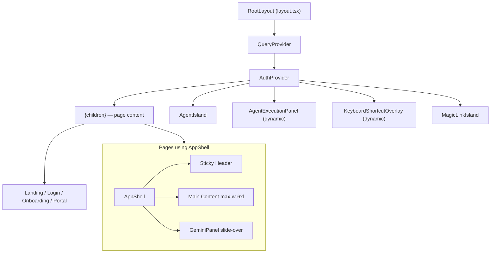

---

## 4. AppShell Layout

The AppShell wraps every authenticated page.

### 4.1 Desktop Wireframe

```
┌──────────────────────────────────────────────────────────────────────────────┐
│  STICKY HEADER  bg-white/80 backdrop-blur  border-b  h-16  z-50             │
├──────────┬───────────────────────────────────────────────┬───────────────────┤
│ ☰ (mob)  │  ◀  [Dashboard][Counterparties][Recon List]  │  (👤 User ▼)     │
│ [Logo]   │      [Discrepancies][Integrations][Reports]    │  [ / ] [🔍] [🔔] │
│          │      [Company Settings]                    ▶  │                   │
├──────────┴───────────────────────────────────────────────┴───────────────────┤
│                                                                              │
│   MAIN CONTENT  max-w-6xl mx-auto  px-4 sm:px-6 lg:px-8  py-6 sm:py-8     │
│                                                                              │
│   ┌────────────────────────────────────────────────────────────────────┐    │
│   │  Page Title                                                        │    │
│   │  Page subtitle                                                     │    │
│   │                                                                    │    │
│   │  [ Stat Cards ] [ Filter Bar ] [ Data Table / Charts ]             │    │
│   └────────────────────────────────────────────────────────────────────┘    │
│                                                                              │
└──────────────────────────────────────────────────────────────────────────────┘
                                                          ┌──────────────────┐
                                                          │ GeminiPanel      │
                                                          │ (420px slide-in) │
                                                          │ Ask Lumina       │
                                                          └──────────────────┘

     ┌─────────────────────────────────────────┐
     │ ⚡ Lumina Agent Running — step message  │  ← AgentIsland (bottom center)
     └─────────────────────────────────────────┘
```

### 4.2 Mobile Navigation Drawer

```
┌─────────────────────────┐
│ ░░░░░ BACKDROP ░░░░░░░░ │  ← tap to close
│ ┌─────────────────────┐ │
│ │ [Avatar] User Name  │ │
│ │          Role       │ │
│ ├─────────────────────┤ │
│ │ ▌ Dashboard         │ │  ← active = green left border
│ │   Counterparties    │ │
│ │   Reconciliation    │ │
│ │   Discrepancies     │ │
│ │   Integrations      │ │
│ │   Reports           │ │
│ │   Company Settings  │ │
│ ├─────────────────────┤ │
│ │ 🚪 Sign Out         │ │
│ └─────────────────────┘ │
└─────────────────────────┘
```

### 4.3 Navigation Items

| Label | Route | Icon |
|-------|-------|------|
| Dashboard | `/dashboard` | LayoutDashboard |
| Counterparties | `/counterparties` | Users |
| Reconciliation List | `/reconciliations` | FileSpreadsheet |
| Discrepancies | `/discrepancies` | AlertTriangle |
| Integrations | `/integrations` | Plug |
| Reports | `/reports` | BarChart2 |
| Company Settings | `/settings` | Settings |

**Active state:** `bg-emerald-50 text-emerald-700 rounded-lg`

---

## 5. Global Components

### 5.1 Component Interaction Diagram

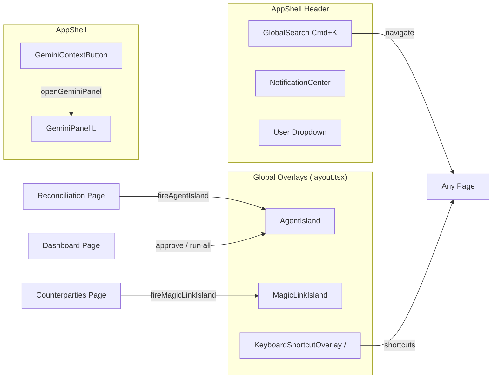

### 5.2 Global Search (`Cmd+K` or header button)

```
┌─────────────────────────────────────────────────────────┐
│  🔍  Search companies, discrepancies, balances...    ✕  │
├─────────────────────────────────────────────────────────┤
│  COUNTERPARTIES                                         │
│  ├─ 🏢 Acme Corp          accounting@acme.com           │
│  └─ 🏢 Beta Industries    VAT: DE123456                 │
│  DISCREPANCIES                                          │
│  ├─ ⚠ INV-2024-001        Amount Mismatch  $1,240       │
│  RECONCILIATION LIST                                    │
│  └─ 📊 Gamma LLC          Ready for External  EUR 50k    │
├─────────────────────────────────────────────────────────┤
│  ↑↓ navigate   ↵ open   esc close                       │
└─────────────────────────────────────────────────────────┘
```

- Blurs header + main when open
- Vector search when backend supports it
- Recent searches stored in `localStorage`

### 5.3 Gemini Panel (`L` key)

```
                                    ┌──────────────────────────┐
                                    │ ✦ Ask Lumina          ✕  │
                                    │ Powered by Gemini        │
                                    ├──────────────────────────┤
                                    │                          │
                                    │  [User message bubble]   │
                                    │                          │
                                    │  [Assistant markdown]    │
                                    │                          │
                                    ├──────────────────────────┤
                                    │ [Context chip if any]    │
                                    │ ┌──────────────────────┐│
                                    │ │ Ask about this...    ││
                                    │ └──────────────────────┘│
                                    │              [Send ➤]   │
                                    └──────────────────────────┘
                                    420px · slides from right
```

### 5.4 AgentIsland (bottom pill)

| Phase | Border | Icon | Message |
|-------|--------|------|---------|
| running | blue | spinner | Current agent step |
| done | emerald | check | "Done — N discrepancies found" |
| error | red | alert | "Agent Error" |

Auto-hides after 6s (success) or 4s (error). Polls `/api/v1/reconciliation/status/{runId}` every 1.5s.

### 5.5 Badge System

**Discrepancy Types (TypeBadge):**

| Type | Color |
|------|-------|
| amount_mismatch | Amber |
| missing_record | Red |
| date_mismatch | Purple |
| duplicate | Orange |

**Discrepancy Status (StatusBadge):**

| Status | Color | Special |
|--------|-------|---------|
| detected | Slate | — |
| awaiting_approval | Yellow | Pulsing dot |
| email_sent | Blue | — |
| resolved | Green | — |
| disputed | Red | — |

---

## 6. Page Reference (with UI Diagrams)

---

### 6.1 Landing Page (`/`)

**Layout:** Full-page marketing site. No AppShell.

```
┌─────────────────────────────────────────────────────────────────┐
│         ╭─────────────────────────────────────────────────╮     │
│         │ [Logo]  Integrations Features Tech    [GitHub][Login→]│  ← floating pill navbar
│         ╰─────────────────────────────────────────────────╯     │
│                                                                 │
│              ░░░ ANIMATED RAINBOW STRIPE HERO ░░░               │
│                                                                 │
│              Reconciliation Reinvented.                         │
│                                                                 │
│         Autonomous B2B financial discrepancy resolution...      │
│                    [ ⚡ Get Started ]                           │
│                                                                 │
├─────────────────────────────────────────────────────────────────┤
│  INTEGRATIONS                                                   │
│     [SAP]──┐                    ┌──[Salesforce]                 │
│     [Oracle]├─── ( Lumina ) ───┤──[Dynamics]                   │
│     [NetSuite]──┘    node      └──[QuickBooks]                 │
│                    [Odoo]                                       │
├─────────────────────────────────────────────────────────────────┤
│  FEATURES — 3 cards with illustrated mock UI                    │
│  [Rapid detection] [Auto matching] [Revenue protection]         │
├─────────────────────────────────────────────────────────────────┤
│  TECHNOLOGY — 2-column grid (ADK, Gemini, MongoDB, MCP...)      │
├─────────────────────────────────────────────────────────────────┤
│  CTA: Built for Enterprise. Auditable by Everyone.              │
├─────────────────────────────────────────────────────────────────┤
│  FOOTER — Legal · GitHub · © 2026 Lumina                        │
└─────────────────────────────────────────────────────────────────┘
```

**Key UX:** Scroll anchors, gradient Login CTA, animated hero background with `mix-blend-mode`.

---

### 6.2 Login (`/login`)

```
┌────────────────────────┬────────────────────────────────────────┐
│  FORM PANEL (480px)    │  VISUAL BANNER (lg+ only)              │
│                        │                                        │
│  [Lumina Logo]         │   ┌────────────────────────────────┐  │
│                        │   │                                │  │
│  Log in to your account│   │   login-bg.webp full bleed     │  │
│  Enter credentials...  │   │                                │  │
│                        │   │   Reconciliation Reinvented.   │  │
│  USERNAME              │   │   (green glow text)            │  │
│  ┌──────────────────┐  │   │                                │  │
│  │ username         │  │   └────────────────────────────────┘  │
│  └──────────────────┘  │                                        │
│  PASSWORD         👁   │                                        │
│  ┌──────────────────┐  │                                        │
│  │ ••••••••         │  │                                        │
│  └──────────────────┘  │                                        │
│                        │                                        │
│  [    Sign in    ]     │                                        │
│                        │                                        │
│  DEMO CREDENTIALS      │                                        │
│  ┌─────────┬─────────┐│                                        │
│  │ admin   │lumina26 ││                                        │
│  └─────────┴─────────┘│                                        │
│  Powered by Gemini...  │                                        │
└────────────────────────┴────────────────────────────────────────┘
```

---

### 6.3 Onboarding (`/onboarding`)

**4-step wizard** — centered card, step indicator at top.

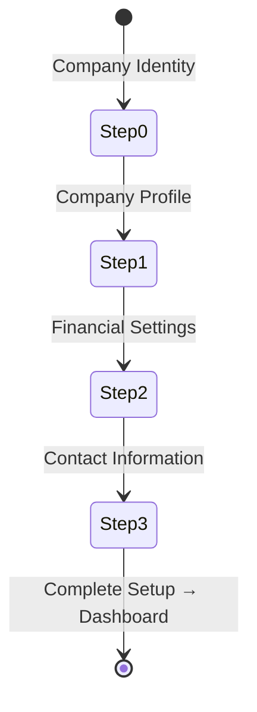

```
┌─────────────────────────────────────────────────────────────┐
│  [Lumina Logo]                                              │
├─────────────────────────────────────────────────────────────┤
│                                                             │
│   (●)────(○)────(○)────(○)   Step indicator                │
│  Identity Profile Financial Contact                         │
│                                                             │
│   ┌─────────────────────────────────────────────────────┐   │
│   │  Company Identity                                   │   │
│   │  Tell us about your organisation's legal identity.  │   │
│   │                                                     │   │
│   │  Company Name *    [________________________]       │   │
│   │  Legal Country *   [United States        ▼]       │   │
│   │  EIN *             [EIN][___________________]       │   │
│   │                                                     │   │
│   │  ← Back          ● ○ ○ ○          Continue →       │   │
│   └─────────────────────────────────────────────────────┘   │
└─────────────────────────────────────────────────────────────┘
```

| Step | Required Fields |
|------|-----------------|
| 0 Identity | company_name, identifier_value (type auto from country) |
| 1 Profile | logo (optional), industry, company_size pills |
| 2 Financial | base_currency grid + select, fiscal year month/day |
| 3 Contact | contact_name, contact_email, phone (optional) |

---

### 6.4 Dashboard (`/dashboard`)

```
┌─────────────────────────────────────────────────────────────────────────┐
│  Dashboard                                    [████████░░] 3/5          │
│  Real-time B2B reconciliation overview          [▶ Reconcile All (5)]   │
├─────────────────────────────────────────────────────────────────────────┤
│  ┌──────────────┐  ┌──────────────┐  ┌──────────────┐                   │
│  │ 🏢 12        │  │ ⚠ 8          │  │ ✉ 3          │  ← animated count │
│  │ Companies    │  │ Active Disc. │  │ Awaiting Appr│                   │
│  │ Monitored    │  │              │  │  (glow)      │                   │
│  └──────────────┘  └──────────────┘  └──────────────┘                   │
├─────────────────────────────────────────────────────────────────────────┤
│  ANALYTICS (when data exists)                                           │
│  ┌─────────────────────────────┐  ┌────────────┐  ┌────────────┐        │
│  │ Discrepancy Trend (bars)    │  │ Type Pie   │  │ Top Issues │        │
│  │ ████ stacked by type        │  │            │  │ 1. Acme 3  │        │
│  └─────────────────────────────┘  └────────────┘  └────────────┘        │
├─────────────────────────────────────────────────────────────────────────┤
│  ┌────────────────────────────────────────────┐  ┌──────────────────┐ │
│  │ ⚡ Discrepancy Feed          (24)            │  │ 📊 Agent Activity│ │
│  │ [All][Awaiting●3][Email Sent][Resolved]      │  │ ● completed      │ │
│  │──────────────────────────────────────────────│  │ ● running +Stop  │ │
│  │ INV-001  [Amount Mismatch]                   │  │ ● failed         │ │
│  │ Acme ↔ Beta · $1,240 · Mar 2   [Awaiting] → │  │                  │ │
│  │ INV-002  [Missing Record]                    │  │ View in Reports→ │ │
│  │ ...                                          │  └──────────────────┘ │
│  └────────────────────────────────────────────┘                         │
└─────────────────────────────────────────────────────────────────────────┘
         │
         └── click row → DiscrepancyModal (approve email draft)
```

**DiscrepancyModal:** Side-by-side ledger comparison, AI-drafted email, Approve & Send button.

**Polling:** Discrepancies 30s · Agent runs 10s

---

### 6.5 Counterparties (`/counterparties`)

```
┌─────────────────────────────────────────────────────────────────────────┐
│  Counterparties     [Template][Import CP][List|Map][Refresh]           │
├─────────────────────────────────────────────────────────────────────────┤
│  MAP VIEW (when toggled):                                               │
│  ┌─────────────────────────────────────────────────────────────────┐    │
│  │         🌍 D3 World Map — nodes by country                      │    │
│  │              ● Own company (center, green)                      │    │
│  │              ● Counterparties (matched/discrepancy/pending)       │    │
│  └─────────────────────────────────────────────────────────────────┘    │
├─────────────────────────────────────────────────────────────────────────┤
│  [Total 24] [Active 20] [Inactive 4] [With ERP Data 18]                 │
├─────────────────────────────────────────────────────────────────────────┤
│  YOUR COMPANY CARD — logo, name, EIN, email, [Initiator] badge          │
├─────────────────────────────────────────────────────────────────────────┤
│  🔍 Search...  [All Status ▼] [All Responses ▼]     24 companies        │
├─────────────────────────────────────────────────────────────────────────┤
│  ☐ │ Company Name    │ Tax ID  │ Email      │ Code │ Status │ Resp │ Act│
│  ☐ │ 🏢 Acme Corp     │ DE123   │ acct@...   │ A001 │ ●Active│ ✓Ag  │ 📁✏🗑▶│
│  ☐ │ 🏢 Beta Ltd      │ GB456   │ fin@...    │ B002 │ ●Active│ —    │ ...  │
├─────────────────────────────────────────────────────────────────────────┤
│  ● Active — ready   ● Inactive — paused   Click row → profile           │
└─────────────────────────────────────────────────────────────────────────┘

     ┌──────────────────────────────────────────┐
     │  3 selected  [Send Selected] [Delete]  ✕ │  ← bulk bar (fixed bottom)
     └──────────────────────────────────────────┘
```

**Modals:** Profile · Edit · Docs (Portal/Internal tabs) · Import (dark dropzone) · Delete confirm

**Context menu (right-click):** View Profile · Send Magic Link · View Docs · Edit · Delete

---

### 6.6 Reconciliation List (`/reconciliations`)

Master balance workflow — the operational core.

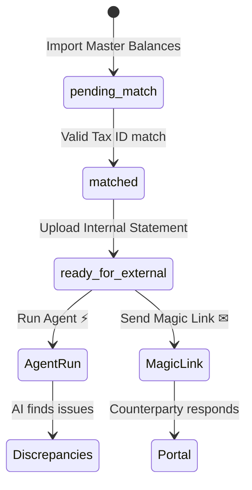

```
┌─────────────────────────────────────────────────────────────────────────┐
│  Reconciliation List   [Global Docs][Import SOA][Import Master Balances]│
├─────────────────────────────────────────────────────────────────────────┤
│  🔍 Search  [Status ▼] [Response ▼] [CCY ▼] [Min $][Max $]   42 records │
├─────────────────────────────────────────────────────────────────────────┤
│  [Total 42] [Matched 30] [Pending 8] [Ready for External 4]             │
├─────────────────────────────────────────────────────────────────────────┤
│  ☐ │ Company      │Code│ Tax ID │ Balance    │CCY│ Status  │Resp │ Act │
│  ☐ │ Gamma LLC    │G01 │ US789  │ $125,000 ✦ │USD│ ● Ready │ —   │👁⚡✉│
│  ☐ │ Delta Inc    │D02 │ US456  │ €45,000    │EUR│ ● Match │ —   │📤   │
│  ☐ │ Epsilon Co   │E03 │ —      │ $12,000    │USD│ ○ Pend  │ —   │📤   │
├─────────────────────────────────────────────────────────────────────────┤
│  ● Pending — import Tax ID  ● Matched — upload stmt  ● Ready — send/run │
└─────────────────────────────────────────────────────────────────────────┘
```

**Row actions by status:**

| Status | Actions |
|--------|---------|
| pending_match / matched | Upload Statement |
| ready_for_external | View 👁 · Run Agent ⚡ · Send ✉ · Docs 📁 |

**✦** = GeminiContextButton on balance cell

---

### 6.7 Discrepancies (`/discrepancies`)

```
┌─────────────────────────────────────────────────────────────────────────┐
│  Discrepancies                                              [Refresh]   │
│  AI-detected mismatches & Human-in-the-Loop approval                    │
├─────────────────────────────────────────────────────────────────────────┤
│  ● 3 email drafts awaiting your approval              Filter →          │
├─────────────────────────────────────────────────────────────────────────┤
│  TYPE:  [All][Amount][Missing][Date][Duplicate]                         │
│  STATUS:[All][Awaiting●3][Detected][Email Sent][Resolved]              │
├─────────────────────────────────────────────────────────────────────────┤
│  All Discrepancies  12 of 12                                            │
│  ─────────────────────────────────────────────────────────────────────  │
│  INV-2024-001  [Amount Mismatch]                                        │
│  Your Co ↔ Acme Corp                          $1,240.00    [Awaiting] → │
│  ─────────────────────────────────────────────────────────────────────  │
│  INV-2024-002  [Missing Record]                                         │
│  Your Co ↔ Beta Ltd                             $890.00    [Detected] → │
└─────────────────────────────────────────────────────────────────────────┘
```

**Empty — all clear:**

```
        ╭───────╮
        │  ✓    │  ← triple ping animation
        ╰───────╯
      All clear!
  No discrepancies detected.
  ⚡ Lumina AI is monitoring...
```

---

### 6.8 Integrations (`/integrations`)

```
┌─────────────────────────────────────────────────────────────────────────┐
│  ERP Integration                              [Refresh][+ New Integration]│
├─────────────────────────────────────────────────────────────────────────┤
│  ┌─────────────────┐ ┌─────────────────┐ ┌─────────────────┐            │
│  │ 🔑 Generate     │ │ 💻 Download     │ │ 🛡 Deploy on    │            │
│  │ Credentials     │ │ Agent Package   │ │ Your Network    │            │
│  └─────────────────┘ └─────────────────┘ └─────────────────┘            │
├─────────────────────────────────────────────────────────────────────────┤
│  🔌 Active Integrations (2)                                           │
│  Name              │ Key Prefix    │ Tracker ID  │ Created │ Actions     │
│  SAP Production    │ lum_abc...    │ trk_xyz...  │ Jan 15  │ [Download][🗑]│
├─────────────────────────────────────────────────────────────────────────┤
│  🛡 Security: API keys bcrypt-hashed. Download regenerates key.         │
└─────────────────────────────────────────────────────────────────────────┘
```

**CreatedKeyModal (one-time):** Show/hide key · Copy · "I've saved the key — Continue"

---

### 6.9 Reports (`/reports`)

```
┌─────────────────────────────────────────────────────────────────────────┐
│  📊 Reports & Analytics        [Refresh][Export Excel][Export PDF]      │
├─────────────────────────────────────────────────────────────────────────┤
│  [Runs 48] [Disc 32] [Resolve 78%] [Exposure $125k] [Complete 94%] [42s]│
├─────────────────────────────────────────────────────────────────────────┤
│  ┌──────────────────────────────┐  ┌─────────────────┐                │
│  │ Discrepancy Trend (90d bars) │  │ Type Pie Chart  │                │
│  └──────────────────────────────┘  └─────────────────┘                │
├─────────────────────────────────────────────────────────────────────────┤
│  ┌──────────────────────┐  ┌──────────────────────────────────────┐     │
│  │ Resolution Status Pie│  │ Top Counterparties by Issues         │     │
│  └──────────────────────┘  └──────────────────────────────────────┘     │
├─────────────────────────────────────────────────────────────────────────┤
│  Portal Responses: [Agreed 12][Disagreed 3][AI 2][Pending 5]  67% bar   │
├─────────────────────────────────────────────────────────────────────────┤
│  DISCREPANCY HEATMAP (GitHub-style, 365 days)                           │
│  Jan Feb Mar ...                                                        │
│  Mon ░░▓▓░░▓▓▓░░▓░ ...                                                  │
│  Wed ░▓░░░▓▓░░▓░ ...                                                    │
│  Fri ░░░▓▓░░░▓▓░ ...                                                    │
├─────────────────────────────────────────────────────────────────────────┤
│  Agent Run Timeline (expandable steps with emoji)                       │
│  ▶ Run abc123  Acme ↔ Beta  completed  +3 disc  Mar 2 14:32            │
│    🏢 Loading → 📥 Fetching → 🔍 Comparing → 🤖 Analyzing → ✅ Complete  │
└─────────────────────────────────────────────────────────────────────────┘
```

---

### 6.10 Company Settings (`/settings`)

```
┌─────────────────────────────────────────────────────────────────────────┐
│  Company Settings                                                       │
│  Manage organisation profile, users, and access roles.                  │
├─────────────────────────────────────────────────────────────────────────┤
│  [Company Profile] [User Management] [Roles & Permissions]  ← tabs      │
├─────────────────────────────────────────────────────────────────────────┤
│  ┌─ Company Identity ──────────────────────────────── [Edit] ─┐        │
│  │  Company Name     Legal Country     EIN/VAT                  │        │
│  │  Acme Corp         United States     12-3456789              │        │
│  └──────────────────────────────────────────────────────────────┘        │
│  ┌─ Company Profile ────────────────────────────────────────────┐        │
│  │  Industry: Manufacturing    Size: 51–200                    │        │
│  └──────────────────────────────────────────────────────────────┘        │
│  ┌─ Financial Settings ─────────────────────────────────────────┐        │
│  │  Base Currency: USD    Fiscal Year Start: 01-01              │        │
│  └──────────────────────────────────────────────────────────────┘        │
│  ┌─ Contact Information ────────────────────────────────────────┐        │
│  │  Jane Smith · jane@acme.com · +1 555 000 0000                │        │
│  └──────────────────────────────────────────────────────────────┘        │
│                                              [Cancel] [Save Changes]    │
└─────────────────────────────────────────────────────────────────────────┘
```

---

### 6.11 Counterparty Portal (`/portal/reconcile?token=…`)

Public page — no authentication. Token-validated.

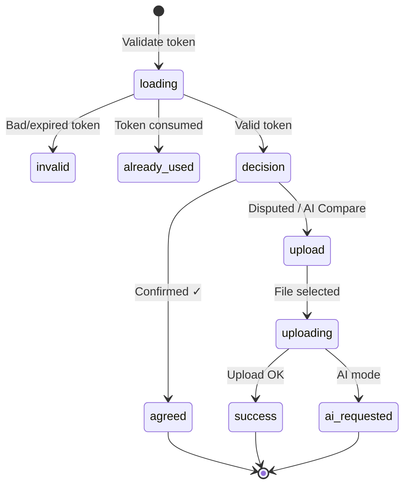

```
┌─────────────────────────────────────────────────────────┐
│                    [Lumina Logo]                        │
│         ┌─────────────────────────────────┐             │
│         │ Reconciliation request from     │             │
│         │ [Avatar] Acme Corporation       │             │
│         └─────────────────────────────────┘             │
│                                                         │
│   ┌─────────────────────────────────────────────────┐   │
│   │ ● ACCOUNT RECONCILIATION REQUEST                │   │
│   │ Do you agree with our records?                  │   │
│   │                                                 │   │
│   │ STATEMENT ENTRIES (12)          Total: $125,000 │   │
│   │ Ref/Desc          Amount        Date            │   │
│   │ INV-001 Acme...   12,500 USD    2026-01         │   │
│   │ ...                                             │   │
│   │                                                 │   │
│   │  ┌─────────────┐  ┌─────────────┐             │   │
│   │  │  👍         │  │  👎         │             │   │
│   │  │ Confirmed   │  │ Disputed    │             │   │
│   │  │ balance OK  │  │ upload stmt │             │   │
│   │  └─────────────┘  └─────────────┘             │   │
│   │                                                 │   │
│   │  ┌─────────────────────────────────────────┐  │   │
│   │  │ 🧠 Let AI Compare — upload for auto recon │  │   │
│   │  └─────────────────────────────────────────┘  │   │
│   │  🔒 256-bit encrypted · Secure portal           │   │
│   └─────────────────────────────────────────────────┘   │
└─────────────────────────────────────────────────────────┘
```

**Security popup (first visit):** Single-use link · Expiry date · Encrypted · Proceed button

**Accepted files:** `.xlsx`, `.xls`, `.csv`, `.pdf`

---

## 7. User Flows

### 7.1 New Tenant Setup

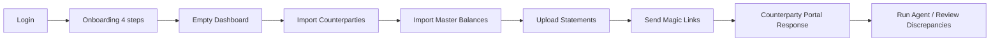

### 7.2 AI Reconciliation with Human Approval

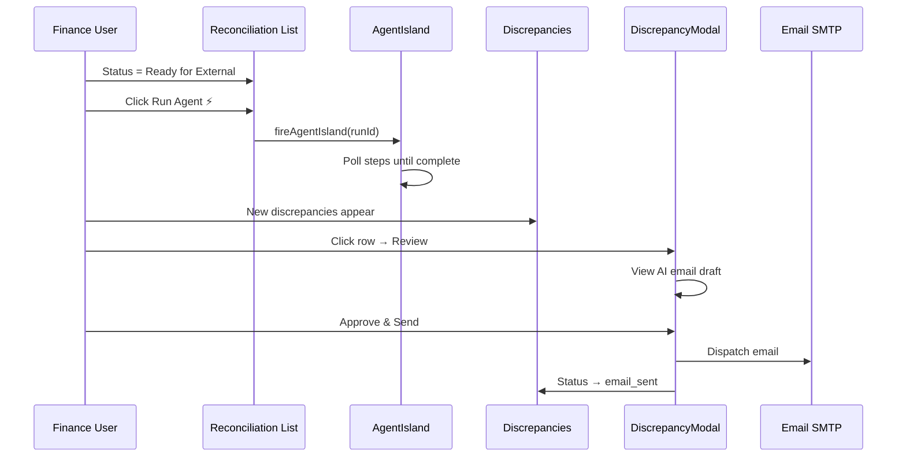

### 7.3 Magic Link → Portal Response

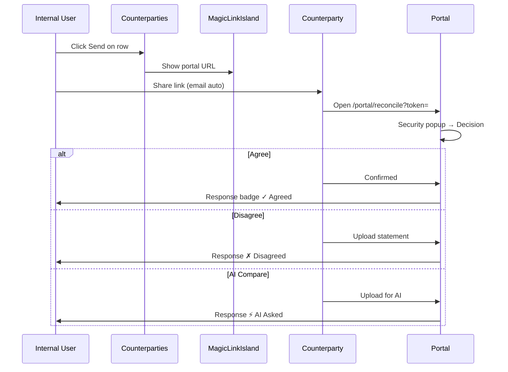

### 7.4 Master Balance Status Pipeline

```
  IMPORT MASTER          UPLOAD STATEMENT         SEND / RUN
  ─────────────         ─────────────────        ───────────
  pending_match    →    matched            →    ready_for_external
       │                      │                        │
       │  Tax ID match        │  Ledger entries        │  Magic link
       │  or auto-create CP   │  saved to DB           │  or Agent ⚡
       ▼                      ▼                        ▼
  [Amber badge]          [Blue badge]             [Green badge]
```

---

## 8. Responsive Behavior

| Breakpoint | Layout Changes |
|------------|----------------|
| `< md` (mobile) | Hamburger drawer nav; tables become stacked cards; hidden column headers; shortened button labels |
| `md+` (tablet) | Horizontal nav with scroll arrows; grid tables visible |
| `lg+` (desktop) | `/` shortcut hint; extra table columns (dates); full button labels |
| Print | Reports page hides toolbar (`print:hidden`); PDF via browser print |

### Mobile vs Desktop Table Pattern

```
DESKTOP (md+):                    MOBILE (< md):
┌──┬──────┬─────┬──────┐         ┌─────────────────────────┐
│☐ │ Name │ Tax │ Act  │         │ ☐ 🏢 Acme Corp      ⋮  │
├──┼──────┼─────┼──────┤         │ TAX ID    STATUS        │
│  │ ...  │     │      │   →     │ DE123     ● Active      │
└──┴──────┴─────┴──────┘         │ EMAIL: acct@acme.com    │
                                 │ [📁][✏][▶ Send]         │
                                 └─────────────────────────┘
```

---

## 9. Keyboard Shortcuts

Press **`/`** to open the shortcut overlay.

| Shortcut | Action |
|----------|--------|
| `/` | Toggle shortcut help overlay |
| `D` | Go to Dashboard |
| `C` | Go to Counterparties |
| `R` | Go to Reports |
| `I` | Go to Integrations |
| `L` | Open Gemini panel |
| `Cmd+K` / `Ctrl+K` | Global search |
| `Cmd+N` / `Ctrl+N` | Counterparties → open Import modal |
| `Esc` | Close overlay / search / modals |

Shortcuts disabled when focus is in input, textarea, select, or dialog.

---

## 10. Permissions & Roles

Permissions are checked via `useAuth().hasPermission()` in Settings; nav items declare permissions but are currently shown to all authenticated users.

| Permission Key | Description |
|----------------|-------------|
| `dashboard.view` | View Dashboard |
| `counterparties.view` | View Counterparties |
| `counterparties.manage` | Manage Counterparties |
| `reconciliations.view` | View Reconciliation List |
| `reconciliations.run` | Run Reconciliation Agent |
| `discrepancies.view` | View Discrepancies |
| `discrepancies.approve` | Approve discrepancy emails |
| `erp_integration.view` | View Integrations |
| `erp_integration.manage` | Manage Integrations |
| `settings.view` | View Company Settings |
| `settings.edit` | Edit Company Settings |
| `users.view` | View Users tab |
| `users.manage` | Manage Users & Roles |

| Role | Integrations | Approve | Settings Edit | Users |
|------|-------------|---------|---------------|-------|
| System Administrator | ✅ | ✅ | ✅ | ✅ |
| Manager | ❌ | ✅ | ❌ | ✅ |
| IT Specialist | ✅ | ❌ | ❌ | ❌ |
| Staff | ❌ | ❌ | ❌ | ❌ |

---

## 11. File Structure

```
frontend/src/
├── app/
│   ├── layout.tsx                 # Root: providers + global islands
│   ├── page.tsx                   # Landing page
│   ├── globals.css                # Base styles, scrollbar
│   ├── login/page.tsx
│   ├── onboarding/page.tsx
│   ├── dashboard/page.tsx
│   ├── counterparties/page.tsx
│   ├── reconciliations/page.tsx
│   ├── discrepancies/page.tsx
│   ├── integrations/page.tsx
│   ├── reports/page.tsx
│   ├── settings/page.tsx
│   ├── portal/reconcile/page.tsx  # Public counterparty portal
│   └── api/auth/                  # Login, logout, mark-onboarded routes
├── components/
│   ├── layout/
│   │   ├── AppShell.tsx           # Header, nav, mobile drawer
│   │   └── QueryProvider.tsx
│   ├── ui/
│   │   ├── AgentIsland.tsx
│   │   ├── AgentExecutionPanel.tsx
│   │   ├── GeminiPanel.tsx
│   │   ├── GeminiContextButton.tsx
│   │   ├── GlobalSearch.tsx
│   │   ├── KeyboardShortcutOverlay.tsx
│   │   ├── MagicLinkIsland.tsx
│   │   ├── NotificationCenter.tsx
│   │   ├── Toast.tsx
│   │   └── Badge.tsx
│   ├── dashboard/
│   │   └── DiscrepancyModal.tsx
│   └── counterparties/
│       └── CounterpartyMap.tsx
├── lib/
│   ├── api.ts                     # All backend API calls
│   ├── auth-context.tsx           # User + permissions
│   └── utils.ts                   # cn, formatCurrency, formatDate
└── types/
    └── index.ts                   # TypeScript interfaces
```

---

## Appendix A — Polling Intervals

| Query Key | Interval | Pages |
|-----------|----------|-------|
| `discrepancies` | 15–30s | Dashboard, Discrepancies, Counterparties |
| `agent-runs` | 10–15s | Dashboard, Reports |
| `master-balances` | 12s | Reconciliations |
| `companies` | 15s | Counterparties |
| `counterparty-portal-responses` | 8–30s | Reconciliations, Counterparties |

---

## Appendix B — Modal Inventory

| Page | Modals |
|------|--------|
| Dashboard | DiscrepancyModal |
| Counterparties | Profile, Edit, Docs, Import, DeleteConfirm |
| Reconciliations | ImportMaster, ImportSOA, UploadStatement, ViewStatement, SendMagicLink, RecordDocs, GlobalDocs, DeleteConfirm |
| Discrepancies | DiscrepancyModal |
| Integrations | Create, CreatedKey, DeleteConfirm |
| Settings | User create/edit, Role create/edit (inline) |
| Portal | Security info popup (inline) |

---

## Appendix C — Known UX Notes

- **My Profile** in user dropdown has no linked route yet
- Nav items are not filtered by permission in AppShell (all links visible)
- Import modal on Counterparties uses a dark theme inside the light app shell
- Portal and landing pages intentionally differ visually from the app console
- Tenant company name from settings overrides Company A display in discrepancy views

---

*Generated for the Lumina project. For backend API details, see the FastAPI routes under `backend/api/routes/`.*
